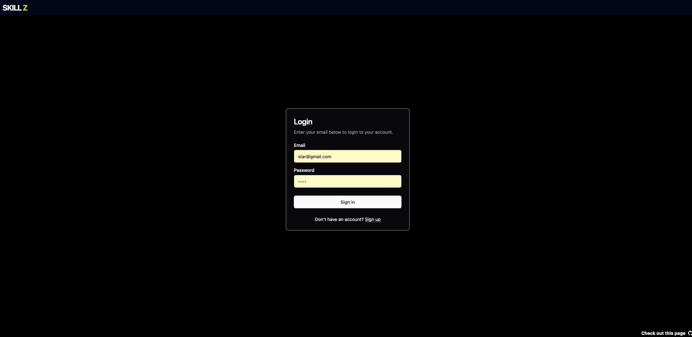
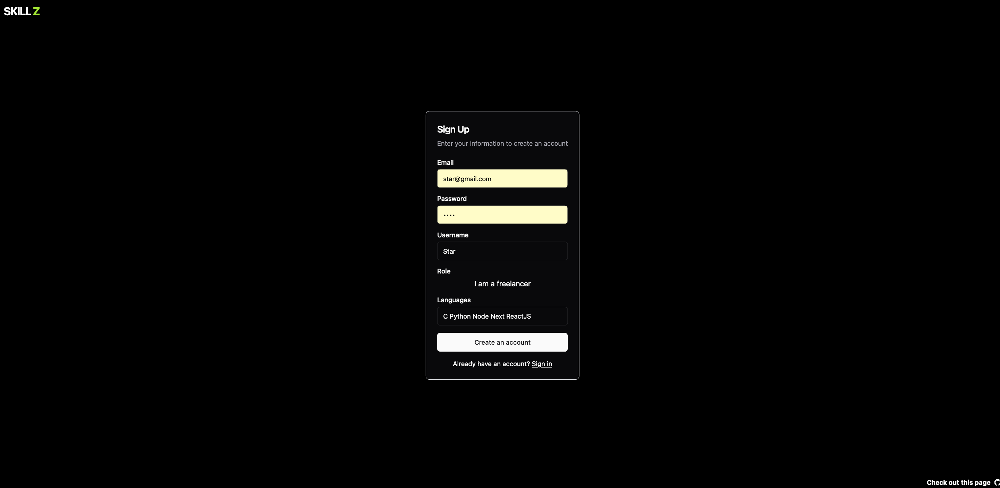
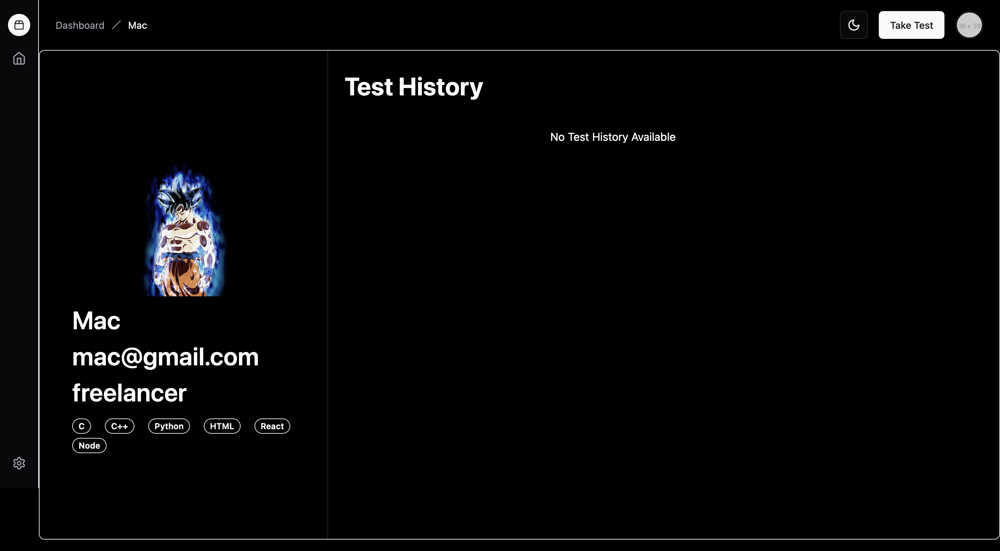
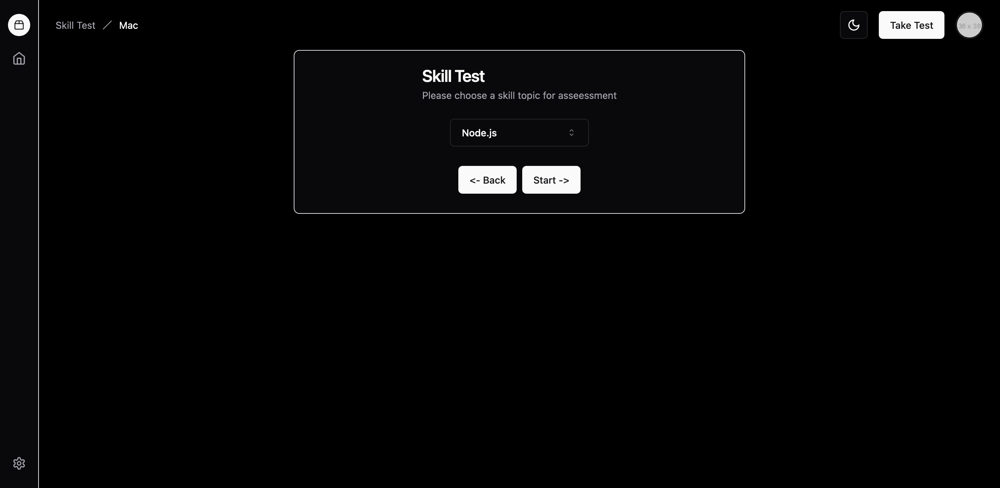
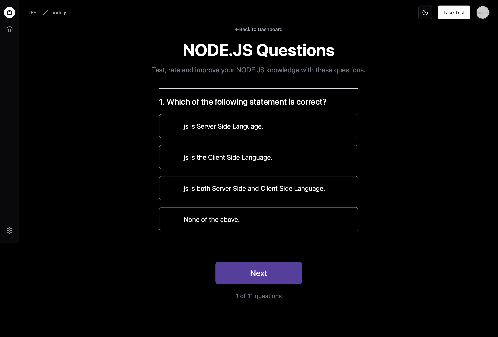
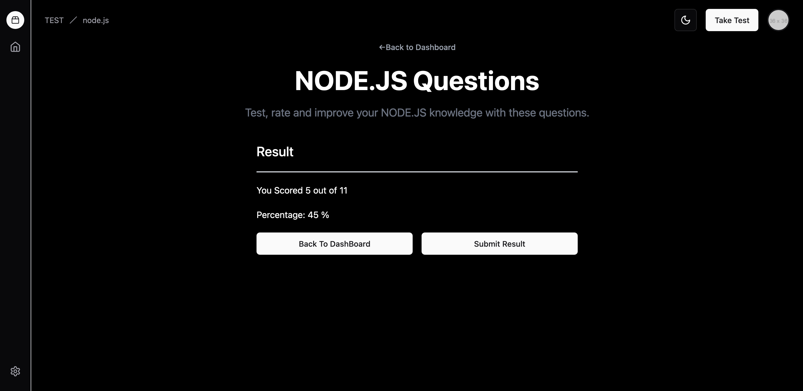
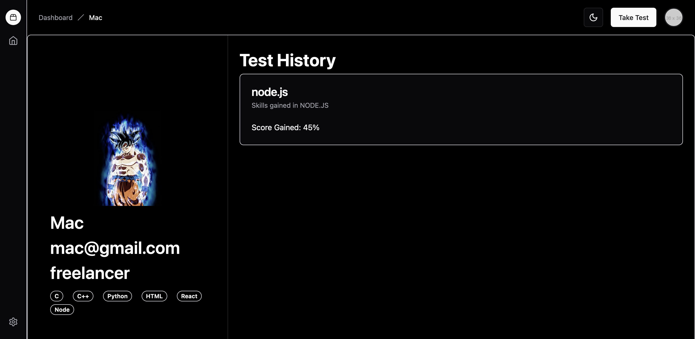

# Interactive Skill Assessment Tool

#### MERN Stack + typescript based app to utilize your skills and showcase your talent


# Screenshots
### Login Page


### Sign-Up Page


### Dashboard


### Select Test Page


### Test Page


### Display Result


### Result updated in Dashboard



## Installation

You can run this app for testing and devlopment by running the following in your terminal

Make sure you have Nodejs install and version above v18.17.0

```bash
git clone https://github.com/ptech12/skillz
```

change to project directory and install dependencies

```bash
cd skillz
```
```bash
npm install
```

Create the Environment Variable file and update the contents

```bash
touch .env
```

Open the .env in a editor and add the backend-server URL
```bash
VITE_API_URL=
```
Start the server 

```bash
npm run dev
```